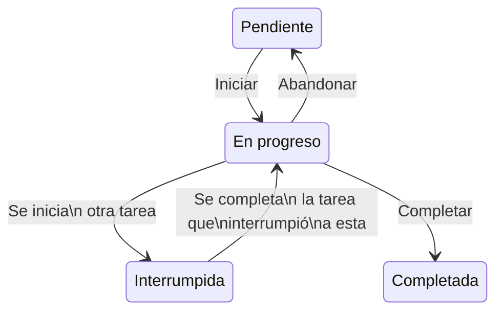

[](https://classroom.github.com/open-in-codespaces?assignment_repo_id=11162841)
# Sistema de gestión de tareas

Este cuatrimestre desarrollaremos un sistema de gestión de tareas (SGT desde ahora). Una tarea tendrá:

- Nombre
- Duración (en horas decimales). Ejemplo: `1.25` es `1h 15m` (mostrar los tiempos en ese formato es opcional).
- Prioridad (las tareas inician sin prioridad, puede asignarse alta prioridad, o baja prioridad)
- Subtareas que la componen.
- Estado (completa, pendiente, en progreso, interrumpida). Solamente se manejarán esos estados.
- Etiquetas (hogar, trabajo, universidad, etc.). Son texto libre a gusto del usuario.

El SGT contará con las siguientes funcionalidades:

## ABMCL de tareas

Ver sección con ejemplo del menú. En resumen:

1. Alta. Una tarea nueva se agrega al sistema.
2. Baja. Se elimina una tarea del sistema.
3. Modificación. Se puede cambiar la prioridad o estado de una tarea.
4. Consulta. Buscar tareas por diferentes criterios.
5. Listado de tareas

## Sobre la creación de tareas

Ver sección con ejemplo del menú. En resumen:

1. Se debe poder agregar subtareas a una tarea. Una subtarea es, en sí misma, una tarea.
2. La duración estimada de una tarea con subtareas vendrá dado por la duración de sus subtareas, más la duración de la propia tarea.

## Gestión de las tareas

Debemos poder:

1. cambiar el estado de una tarea
   - Las subtareas se pueden marcar como completadas, pero la tarea original debe marcarse por separado.
   - Sin embargo, si una tarea se marca como completada, se deben marcar todas las subtareas en ese mismo acto.
2. Subir y bajar la prioridad de tareas



## Estructuras y funcionamiento

1. Todas las tareas estarán guardadas principalmente en una lista.
2. Deben poder gestionarse interrupciones de la tarea en progreso, por una nueva tarea. Al terminar la interrupción, se debe continuar con la última tarea interrumpida.

## Consultas al sistema

1. El sistema podrá **sugerir** una serie de tareas a realizar, para maximizar la productividad. Le pediremos que nos organice una selección de tareas que cumplan con un criterio de tiempo total.
2. El sistema puede proporcionar un listado de tareas con cierta etiqueta, para así localizar mis tareas más eficientemente.
3. El sistema debe poder reordenar las tareas de primer nivel según alguno de estos criterios:
   1. Prioridad
   2. Duración
   3. Cantidad de subtareas
4. El sistema debe permitir buscar una tarea por una palabra determinada.

---

## Menú

1. Listado de Tareas (cada una con su duracion, prioridad y estado)
   1. (elige una tarea)
      1. Editar nombre
         1. Nuevo nombre
      2. Editar duracion
         1. Nueva duración
      3. Subir prioridad
      4. Bajar prioridad
      5. Editar etiquetas
         1. Nuevas etiquetas (separadas por comas)
      6. Comenzar tarea
      7. Nueva subtarea
         1. Menu similar a #2
      8. Borrar tarea
2. Nueva Tarea
   1. Nombre
   2. Duración
   3. Etiquetas (separadas por comas)
3. Tarea actual
   1. Marcar como completada
   2. Abandonar (vuelve a pendiente)
4. Preparar cola de tareas
   1. Tiempo disponible
      1. (sistema ofrece tareas)
5. Buscar tarea
   1. Palabra clave
      1. (sistema muestra lista de tareas)
         1. (elige una tarea)
            1. Vuelve al menu 1.1
   2. Por tag
      1. (elige tag)
         1. (sistema muestra lista de tareas)
            1. (elige una tarea)
               1. Vuelve al menu 1.1
6. Reordenar tareas
   1. Por prioridad
   2. Duración
   3. Cantidad de subtareas

Ejemplo de como luce una lista de tareas:

```
Listado de tareas
1. [X] !! Sacar a pasear al perro (30 min) #hogar
2. [ ] Comprar leche (15 min + 20 min) #hogar
    2.1. [X] Ir al super (15 min)
    2.2. [ ] Pagar (15 min)
3. [ ] Preparar trabajo práctico de AyP2 (2h) #universidad
4. [ ] Merendar (1h) #hogar

Tarea actual
> Merendar (1h) #hogar

Tareas interrumpidas (2)
1. Preparar trabajo práctico de AyP2 (2h) #universidad
... y otras

Tags
#hogar (3)
#universidad (1)

Opciones
a. Nueva tarea
b. Tarea actual
c. Preparar cola de tareas
d. Buscar tarea
e. Reordenar tareas
```

**Los menús son ilustrativos y pueden ser modificados para ofrecer todas las funciones solicitadas, para mejorar la experiencia del usuario.**
